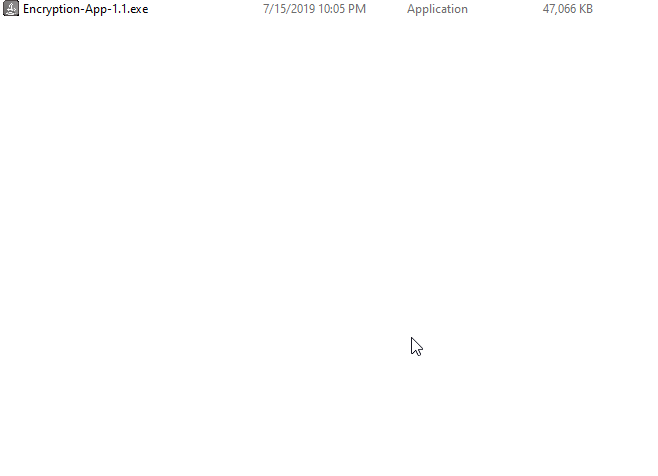
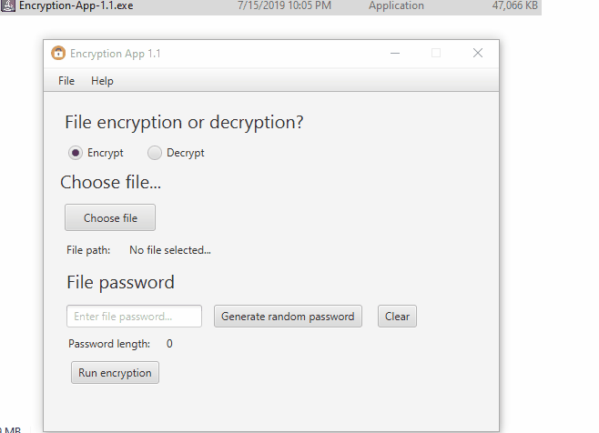
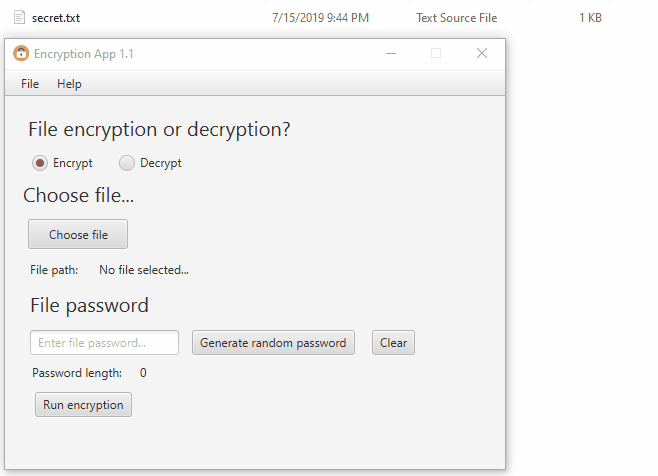
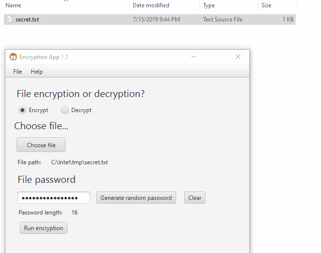
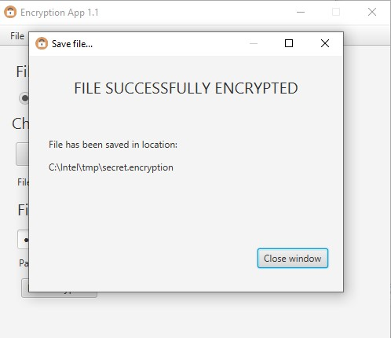
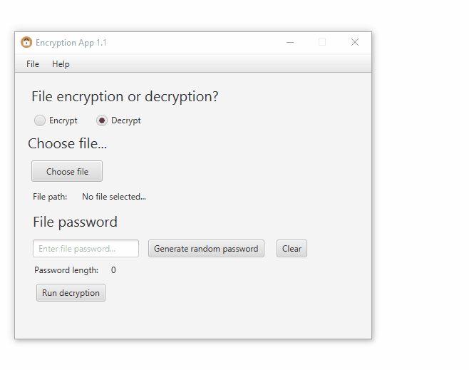
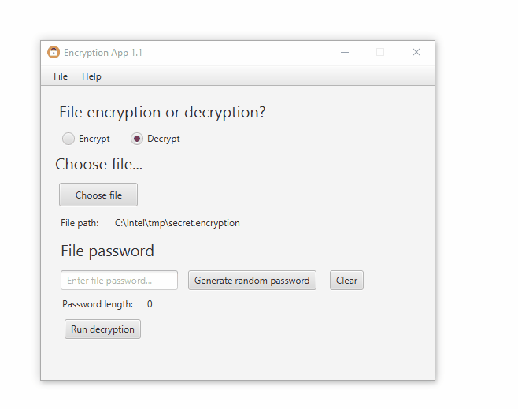
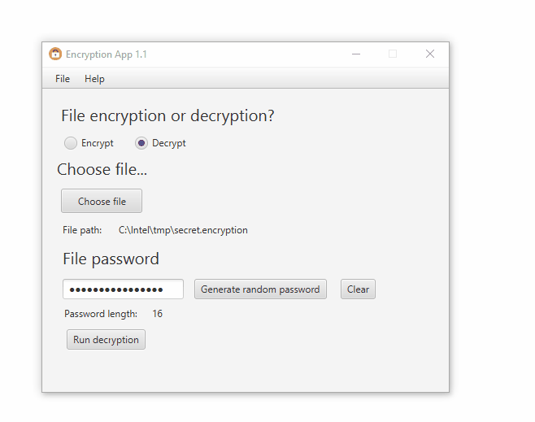

# Encryption App

Simple encryption app written in Java and JavaFX, uses [AES](https://en.wikipedia.org/wiki/Advanced_Encryption_Standard) encryption.

## Getting Started


* To clone this project to yor local environment you simple type in command line: 
```
git clone https://github.com/tomaszkyc/encryption-app.git
```

* To build this project you will need Ant tool ( I was using the existing one in [Eclipse](https://www.eclipse.org/downloads/packages/release/2019-06/r/eclipse-ide-java-developers))


### Prerequisites

What things you need to install the software and how to install them


* JDK version > 8 (example: [Amazon Correto JDK 8](https://docs.aws.amazon.com/corretto/latest/corretto-8-ug/downloads-list.html))


### Installing

1. **Download the setup file** from [here](https://github.com/tomaszkyc/encryption-app/raw/master/build/deploy/bundles/Encryption-App-1.1.exe)


2. Run the setup as below:




3. When setup is done - the app will open automatically:




# How it works

The application uses [AES](https://en.wikipedia.org/wiki/Advanced_Encryption_Standard) encryption to decrypt and encrypt files you will choose.

## To encrypt file

Let's say we have a text file called **secret.txt** with content:
```
secret message
```


1. Open app, make sure te **"Encrypt"** type is choosen.

2. Select file by clicking **"Choose file"** button:  


3. After that click in button **"Generate random password"** or enter your own password in password field. Notice that AES password have to be: 16, 24 or 32 characters long. After clicking the button you will have two options:
    * Copy generated password to clipboard
    * Do not copy generated password to clipboard (this password will be used for encrypting and decrypting file - you show save this password on your own).  
    

4. The final step is clicking **Run encryption** button as below and choosing destination path of encrypted file. Notice that all encrypted files will **have .encrypted extension**.  


5. After encryption there will be a message about success file encryption:  


6. My plain text: 
```
secret message
```
and his cipher text for given AES key: 
```
¶8 ŽcÁNSs])מ<
```


## To decrypt file

Let's say we have an encrypted file called **secret.encrypted**.


1. Open app, make sure te **"Decrypt"** type is choosen.

2. Select file by clicking **"Choose file"** button and choose **file with .encrpted extension**:



3. Put your password to decrypt file in password field.



4. The final step is clicking **Run decryption** button as below and choosing destination path of decrypted file. Notice that all decrypted files will have no extension.



5. After decyption there will be a message about success file encryption:


6. My cipher text: 
```
¶8 ŽcÁNSs])מ<
```
and plain text with given AES key:
```
secret message
```


## Testing

Application Was tested on:

```
Windows 10 1903 (OS build: 18362.239)
```

## Built With

* [Apache Ant](https://ant.apache.org/) - Build tool
* [JavaFX](https://docs.oracle.com/javafx/2/overview/jfxpub-overview.htm) - JavaFX framework


## License

This project is licensed under the MIT License - see the [LICENSE.md](LICENSE.md) file for details

